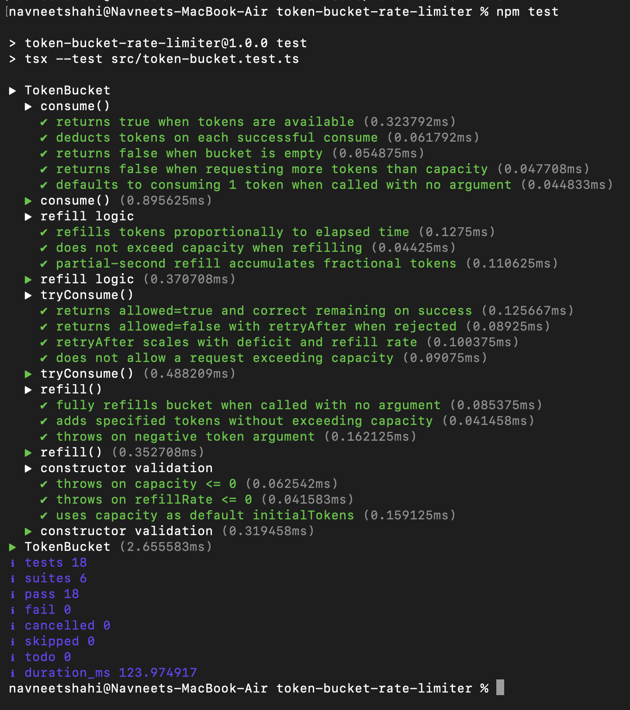
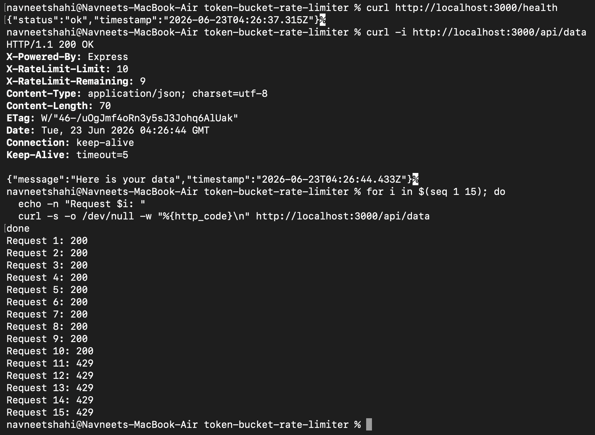

# Token Bucket Rate Limiter

A TypeScript implementation of the [token bucket algorithm](https://en.wikipedia.org/wiki/Token_bucket) for Node.js — usable standalone or as Express middleware. Zero runtime dependencies beyond Express.

---

## Table of contents

- [How it works](#how-it-works)
- [Installation](#installation)
- [Screenshots](#screenshots)
- [Running the demo server](#running-the-demo-server)
- [Testing with curl](#testing-with-curl)
- [Using the TokenBucket class directly](#using-the-tokenbucket-class-directly)
- [Express middleware](#express-middleware)
- [API reference](#api-reference)
- [Running the tests](#running-the-tests)
- [File structure](#file-structure)
- [Design notes](#design-notes)

---

## How it works

Imagine a bucket with a hole in it:

```
  Requests in        Tokens
  ──────────►  [■■■■■■■■■■]  capacity = 10
               [■■■■■■■■  ]  after 2 requests
               [          ]  bucket empty → 429
                    ▲
                    │  refills at 2 tokens/sec
```

- The bucket starts full (up to `capacity` tokens).
- Each request **consumes** one token.
- Tokens **refill** continuously at `refillRate` per second.
- When the bucket is empty, requests are **rejected** with HTTP 429 until enough tokens have accumulated.
- **No background timers** — refill is calculated lazily from wall-clock elapsed time on each request.

This gives you two knobs:

| Knob | Controls |
|------|----------|
| `capacity` | Burst size — how many back-to-back requests are allowed |
| `refillRate` | Sustained throughput — requests per second over time |

---

## Installation

```bash
git clone <repo>
cd token-bucket-rate-limiter
npm install
```

Requirements: **Node.js 18+**

---

## Screenshots

### Test suite — 18 tests, 0 failures



All tests run via Node's built-in `node:test` runner with a mocked clock — no flaky timing, no external test framework.

---

### Live demo — health check, rate-limit headers, burst test



The burst loop sends 15 requests instantly. The first 10 consume the full bucket and return `200`. Requests 11–15 hit the empty bucket and get `429 Too Many Requests`.

---

## Running the demo server

```bash
npm run dev      # hot-reload with tsx watch
# or
npm start        # plain node
```

The server starts on `http://localhost:3000` with three routes:

| Route | Rate limit |
|-------|-----------|
| `GET /api/data` | 10 capacity, 2 tokens/sec |
| `GET /api/premium` | 50 capacity, 10 tokens/sec |
| `GET /health` | unprotected |

---

## Testing with curl

**Check headers on a single request:**

```bash
curl -i http://localhost:3000/api/data
```

You'll see:

```
HTTP/1.1 200 OK
X-RateLimit-Limit: 10
X-RateLimit-Remaining: 9
```

**Burst through the limit — watch 429s appear after request 10:**

```bash
for i in $(seq 1 15); do
  echo -n "Request $i: "
  curl -s -o /dev/null -w "%{http_code}\n" http://localhost:3000/api/data
done
```

Expected output:

```
Request 1:  200
Request 2:  200
...
Request 10: 200
Request 11: 429
Request 12: 429
...
```

**Inspect the 429 response body and Retry-After header:**

```bash
curl -i http://localhost:3000/api/data   # after exhausting the bucket
```

```
HTTP/1.1 429 Too Many Requests
Retry-After: 1
X-RateLimit-Remaining: 0

{"error":"Too Many Requests","retryAfter":1}
```

---

## Using the TokenBucket class directly

```ts
import { TokenBucket } from "./src/token-bucket.js";

const bucket = new TokenBucket({
  capacity: 10,      // max tokens (burst limit)
  refillRate: 2,     // tokens added per second
  initialTokens: 10, // optional — defaults to capacity
});

// Simple boolean check
if (bucket.consume()) {
  console.log("allowed");
} else {
  console.log("rejected");
}

// Detailed result
const result = bucket.tryConsume();
if (!result.allowed) {
  console.log(`Try again in ${result.retryAfter}s`);
}

// Inspect state
const { tokens, capacity, refillRate } = bucket.getState();
```

---

## Express middleware

```ts
import express from "express";
import { rateLimiter } from "./src/middleware/express.js";

const app = express();

// Apply to a single route
app.get("/api/data", rateLimiter({ capacity: 10, refillRate: 2 }), (req, res) => {
  res.json({ message: "ok" });
});

// Apply to a group of routes
app.use("/api", rateLimiter({ capacity: 20, refillRate: 5 }));

// Custom key (e.g. rate-limit by API key instead of IP)
app.use(rateLimiter({
  capacity: 100,
  refillRate: 10,
  keyBy: (req) => req.headers["x-api-key"] as string ?? req.ip ?? "unknown",
}));

// Custom rejection response
app.use(rateLimiter({
  capacity: 10,
  refillRate: 2,
  onRejected: (req, res, result) => {
    res.status(429).json({
      error: "Slow down!",
      retryAfter: Math.ceil(result.retryAfter ?? 1),
    });
  },
}));
```

Each unique key gets its own isolated bucket — one client being rate-limited does not affect others.

---

## API reference

### `new TokenBucket(options)`

| Option | Type | Required | Description |
|--------|------|----------|-------------|
| `capacity` | `number` | yes | Maximum tokens the bucket can hold (burst limit) |
| `refillRate` | `number` | yes | Tokens added per second |
| `initialTokens` | `number` | no | Starting token count — defaults to `capacity` |

---

### `consume(tokens?: number): boolean`

Consumes `tokens` (default `1`) and returns `true` if the request is allowed or `false` if rejected. Applies lazy refill before checking.

```ts
bucket.consume()     // consume 1
bucket.consume(3)    // consume 3 at once
```

---

### `tryConsume(tokens?: number): ConsumeResult`

Same as `consume` but returns a structured result instead of a plain boolean.

```ts
interface ConsumeResult {
  allowed: boolean;
  remaining: number;      // tokens left after this call
  retryAfter?: number;    // seconds to wait before retrying (only set when rejected)
}
```

```ts
const { allowed, remaining, retryAfter } = bucket.tryConsume();
```

---

### `refill(tokens?: number): void`

Manual refill override.

```ts
bucket.refill();     // restore to full capacity
bucket.refill(5);    // add 5 tokens (capped at capacity)
```

---

### `getState(): BucketState`

Returns current bucket state after applying pending refill. Useful for monitoring or debugging.

```ts
interface BucketState {
  tokens: number;
  capacity: number;
  refillRate: number;
}

const state = bucket.getState();
```

---

### `rateLimiter(options): RequestHandler`

Express middleware factory.

| Option | Type | Default | Description |
|--------|------|---------|-------------|
| `capacity` | `number` | required | Bucket capacity |
| `refillRate` | `number` | required | Tokens per second |
| `keyBy` | `(req) => string` | `req.ip` | How to identify each client |
| `onRejected` | `(req, res, result) => void` | 429 + JSON body | Custom rejection handler |

**Response headers added to every request:**

| Header | Description |
|--------|-------------|
| `X-RateLimit-Limit` | The configured `capacity` |
| `X-RateLimit-Remaining` | Tokens left after this request |
| `Retry-After` | Seconds until retry (429 responses only) |

---

## Running the tests

```bash
npm test
```

Uses Node's built-in `node:test` runner — no Jest, no Vitest. The test suite mocks `Date.now` so all time-dependent assertions are fully deterministic.

```
# tests 18
# pass  18
# fail  0
```

Test coverage:

- `consume` — allowed, rejected, deduction, default argument
- Refill — proportional to elapsed time, capacity ceiling, sub-second accumulation
- `tryConsume` — `retryAfter` value, deficit scaling, over-capacity request
- `refill()` — full restore, partial add, negative argument throws
- Constructor — invalid `capacity`, invalid `refillRate`, default `initialTokens`

---

## File structure

```
token-bucket-rate-limiter/
├── src/
│   ├── token-bucket.ts          Core TokenBucket class
│   ├── middleware/
│   │   └── express.ts           Express middleware factory
│   ├── server.ts                Demo Express server
│   └── token-bucket.test.ts     Unit tests (node:test)
├── package.json
├── tsconfig.json
└── README.md
```

---

## Design notes

**No background timers.** There is no `setInterval` anywhere. Refill is computed on every call:

```
elapsed = (Date.now() - lastRefillTime) / 1000
earned  = elapsed * refillRate
tokens  = Math.min(tokens + earned, capacity)
```

This means the bucket is free to create and destroy without cleanup — safe to use inside serverless functions or short-lived processes.

**Per-key isolation.** The middleware holds a `Map<string, TokenBucket>`. Each client key gets its own bucket instance; one client exhausting their limit has no effect on others.

**Burst, then steady state.** A fresh bucket starts full, so the first `capacity` requests go through immediately. After that, the rate settles to `refillRate` requests per second. This is the defining property of token buckets vs. fixed-window limiters.
# token-bucket-rate-limiter
